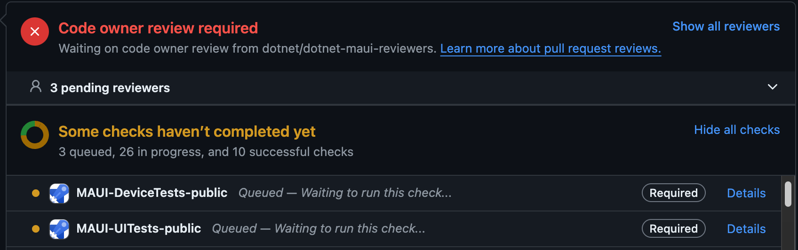
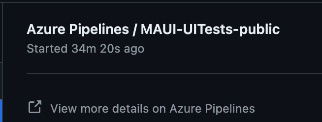
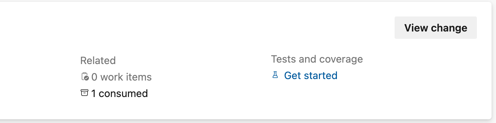
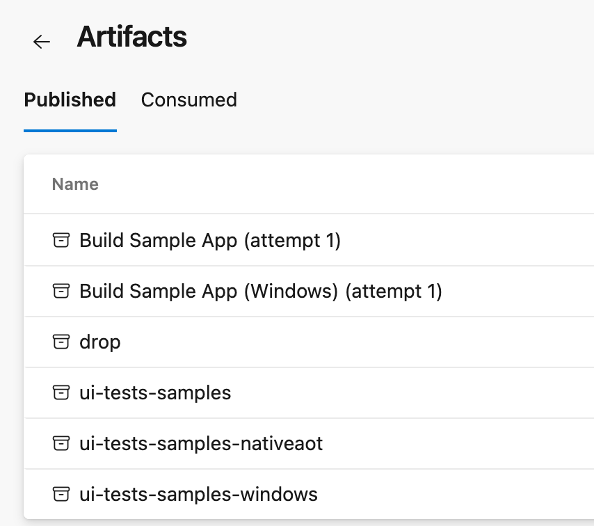
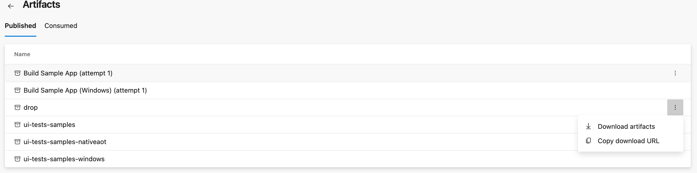
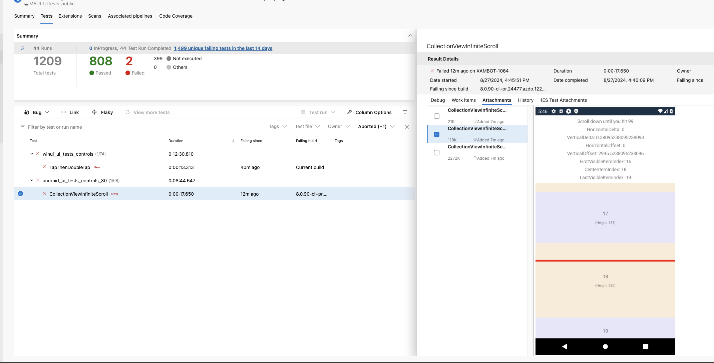

# UI Testing

## Table of Contents

1. [Note for New Contributors](#note-for-new-contributors)
2. [Introduction](#introduction)
3. [Creating a new test](#creating-a-new-test)
4. [Advanced Testing Configuration](#advanced-testing-configuration)
    - [Test Execution Properties](#test-execution-properties)
    - [Test Categories](#test-categories)
5. [Types of Tests in MAUI](#types-of-tests-in-maui)
6. [Downloading NuGet Packages from PR Builds](#downloading-nuget-packages-from-pr-builds)
7. [Common UI Testing Gotchas](#common-ui-testing-gotchas)
    - [AutomationId with CollectionView](#automationid-with-collectionview)
    - [AutomationId with Layouts on Windows](#automationid-with-layouts-on-windows)
    - [Platform-Specific AutomationId Considerations](#platform-specific-automationid-considerations)
    - [Best Practices for Test Organization](#best-practices-for-test-organization)
    - [Troubleshooting Common Test Failures](#troubleshooting-common-test-failures)
8. [Building and Running tests](#building-and-running-tests)
9. [Logging](#logging)
10. [Known Issues](#known-issues)

# Note for New Contributors

We recommend writing tests with Appium, commonly called UI tests. Appium allows for automation to test the app and can be run through the IDE from start to finish like a typical unit test. For more information about different testing approaches, see the [Types of Tests](#types-of-tests-in-maui) section below.

For comprehensive information about testing strategies in MAUI, you can also refer to [Types of Tests documentation](https://github.com/mattleibow/DeviceRunners/wiki/Types-of-Tests).

# Introduction

Currently we are using [Appium](https://appium.io/docs/en/2.0/) to facilitate UI automation for Windows, Catalyst, iOS, and Android.
Appium relies on different implementations called `drivers` for each platform that have different behaviors/functions.

-   Windows - [WinAppDriver](https://github.com/appium/appium-windows-driver)
-   Catalyst - [mac2](https://github.com/appium/appium-mac2-driver)
-   iOS - [XCUITest](https://github.com/appium/appium-xcuitest-driver)
-   Android - [UIAutomator2](https://github.com/appium/appium-uiautomator2-driver)

## Creating a new test

### Adding a new Issue

This will be the majority of new tests added which will be primarily for testing functionality and adding regression tests.

## Adding a Reproduction to the Test App

You will need to create some kind of UI to test against, which will go in the Controls.TestCases.HostApp project. This will be an actual MAUI app under test and has no dependency on Appium. Create a new class within `src/Controls/tests/TestCases.HostApp/Issues` and attribute it with `[Issue]`. Create it like any normal page you would make in app to reproduce the issue. This could be just in XAML or just code, along with a screenshot.
This project requires a rebuild after making changes because the `Controls.TestCases.Shared.Tests` is loosely coupled to this project. It initiates a previously compiled executable from `src/Controls/tests/TestCases.HostApp`.

When working on a single test case it may be convenient to start the app by using the issue page as the main one.
This can be easily achieved by creating a `MauiProgram.user.cs` file in the `src/Controls/tests/TestCases.HostApp` folder and adding the following code:

```csharp
using Controls.TestCases.HostApp.Issues;

namespace Maui.Controls.Sample;

public partial class MauiProgram
{
	static partial void OverrideMainPage(ref Page mainPage)
	{
		mainPage = new Issue99999(); // My issue number here
	}
}
```

That file is not tracked by git, so it won't be committed by mistake.

## Adding a Test to Interact with the Reproduction

Next you will need to create the appium test in the `Controls.TestCases.Shared.Tests` project, which is a library project that runs NUnit tests via Appium. Add a new class with the same name as the Reproduction within this folder: `src/Controls/tests/TestCases.Shared.Tests/Tests/Issues`. Have the class derive from `_IssuesUITest` and add your test(s) as methods.

## Link them together with the Issue String

An important component that you need in order for Appium to run your test is to add a string with a text description of your class. In the class defined in the HostApp project, add an Issue attribute above the class signature. For example:
`[Issue(IssueTracker.Github, 2680, "Add VerticalScrollMode/HorizontalScrollMode to ListView and ScrollView", PlatformAffected.All)]`

Then in the class defined in the TestsCases project, assign the string to a property called `Issue` as so:
`public override string Issue => "Add VerticalScrollMode/HorizontalScrollMode to ListView and ScrollView";`

It is <b>imperative</b> that both strings are identical, as Appium will use the `Issue` string in the search box of the app to find the Issue as it is defined by its attribute.

You can use the example for the sample project: here is the [xaml](https://github.com/dotnet/maui/pull/24165/files#diff-6bbe6730a6964c64dc513d2b6f9fa207f65518dec40077c3d217394fcb7f09fbR36) and the [xaml.cs](https://github.com/dotnet/maui/blob/443afb7d07cdd42e9b0091b17d00f76d92b3c3b7/src/Controls/tests/TestCases.HostApp/Issues/Issue11969.xaml.cs) and the example for the corresponding test [here](https://github.com/dotnet/maui/blob/443afb7d07cdd42e9b0091b17d00f76d92b3c3b7/src/Controls/tests/TestCases.Shared.Tests/Tests/Issues/Issue11969.cs).

### Interacting with Elements in Tests

All controls you intend to interact with need to set the `AutomationId` property as this will be what you use to query for the element. You can either set it in the xaml as an attribute when you create the element or you can assign it when you create the element in the `*.cs` file.

**Important Notes:**

-   AutomationId will not work on layouts on Windows. This is because Appium uses the accessibility tree to locate elements, and layouts are not visible in the accessibility tree. You will have to focus on the individual elements such as label, entry, editor, and so on.
-   For CollectionView, don't add AutomationId to the CollectionView itself, but to child elements. iOS doesn't support nested views with accessibility.

See the [Common UI Testing Gotchas](#common-ui-testing-gotchas) section for detailed examples and best practices.

### Example

The test will have access to gestures/interactions through the `App` property.

```csharp
App.WaitForElement("btnLogin");
App.EnterText("entryUsername", "user@email.com");
App.EnterText("entryPassword", "Password");

App.Tap("btnLogin");
var lblStatus = App.WaitForElement("lblStatus").FirstOrDefault();
var text = lblStatus?.Text;

Assert.IsNotNull(text);
Assert.IsTrue(text.StartsWith("Logging in", StringComparison.CurrentCulture));
```

### Screenshots

Testing against a previously saved screenshot of the simulator can be an important asset when it comes to writing tests. Currently, this is how you can do so when using the CI:

1. Call `VerifyScreenshot()` at the end of your test method.

2) Start a pull request, and have it run on the CI.
3) Navigate to the bottom of the request where there is a list of the various checks on the CI. Scroll down until you see `Maui-UITestpublic` (will have a required bubble next to it) and and click Details.
   Scroll down the page until you see "View More Details on Azure Pipelines" .

    At the top of the summary page, you should see a box with Repositories, Time Started and Elapsed, Related, and Tests and Coverage. Click on the "Consumed" link below the "Related" heading. 

    Click on the three dots to the right of "Drop" to download it. 

4) When you unzip the archive, navigate to the `Controls.TestCases.Shared` folder which will have the snapshot. NOTE: in future testing, if this test will have failed, the snapshot will have a -diff attached to its filename, with red outlining to indicate problem areas.
5) Add the snapshot .png to your test. Each platform has its own TestCases project will have a snapshots folder within it to add your .png.  Please ensure that the file has the same name as the TestMethod that will call `VerifyScreenshots()`. Note: TestCases.IOS.Tests has two sub-folders within its `snapshots` folder, `ios` and `ios-iphonex`. You only have to submit your screenshot to the ios folder.
6) Commit the change to your PR.

Once everything is committed, you will be able to see screenshots produced by CI whenever you access failed tests:


## Adding a GalleryPage

Gallery tests are to make it easier to run the same set of tests on controls, if you are creating a new control you would want to add a new gallery page.

We have some base classes you can derive from to make setting this up easier: [CoreGalleryPage](https://github.com/dotnet/maui/blob/main/src/Controls/tests/TestCases.HostApp/CoreViews/CoreGalleryPage.cs) and [ContentViewGalleryPage](https://github.com/dotnet/maui/blob/main/src/Controls/tests/TestCases.HostApp/Elements/ContentViewGalleryPage.cs)

### Restarting the App after a Test

For legacy reference, the `ResetAfterEachTest` property can be used to restart the app between test methods. See the [Advanced Testing Configuration](#advanced-testing-configuration) section for detailed information.

### Handling different operating systems

There may be times when you want to have the test run on some platforms and not others. For example, `VerifyScreenshot()` does not currently work on MacCatalyst. In this case, you would want to use preprocessor directives:

```csharp
#if ! MACCATALYST
//your code here
#endif
```

When you compile `Controls.TestCases.Mac.Tests`, the test will not appear in the list of tests.

## Building and Running tests

Please see the [wiki](https://github.com/dotnet/maui/wiki/UITests) for setting up/running tests.

## Logging

Follow the steps above for accessing Screenshots to access the logs from the drop folder. All platforms will have a log produced by Appium with the name `appium_<platform_name>.log` that can be consulted for Appium output.

IOS - `logarchive` files from the console output of the simulator (currently there might be logarchives from other simulators so be sure to validate that there are logs from your test run in the log archive).

Android - If a test fails or the device crashes, there will be a `logcat` file in this folder that you can look at for information.

Windows & Mac - Log output for these platforms are currently only available in [Device Tests](https://github.com/dotnet/maui/wiki/DeviceTests).

## Advanced Testing Configuration

### Test Execution Properties

#### ResetAfterEachTest Property

By default, when multiple tests are run, all methods under one class will be tested in the same instance of the app. The app will then restart as it changes to the next test class. If you would like the app to be restarted after each method in the class, add this override property to your class:

```csharp
protected override bool ResetAfterEachTest => true;
```

This is particularly useful for tests that:

-   Modify application state that persists between test methods
-   Test navigation flows that need a clean starting state
-   Deal with memory-sensitive scenarios where a fresh app instance is required

#### MovedToAppium Attribute

When migrating tests from legacy testing frameworks to Appium, use the `MovedToAppium` attribute to mark tests that have been converted:

```csharp
[Test]
[MovedToAppium]
[Category(UITestCategories.Button)]
public void ButtonClickTest()
{
    // Test implementation
}
```

This helps track the migration progress and ensures proper test categorization.

### Test Categories

All UI tests should be properly categorized using the `UITestCategories` constants. This enables:

-   Selective test execution in CI pipelines
-   Better organization and filtering of test results
-   Platform-specific test targeting

**Available Categories Include:**

-   `UITestCategories.CollectionView` - For CollectionView-related tests
-   `UITestCategories.Button` - For Button control tests
-   `UITestCategories.Layout` - For layout-related tests
-   `UITestCategories.Navigation` - For navigation and routing tests
-   `UITestCategories.Shell` - For Shell-specific functionality
-   `UITestCategories.ManualReview` - For tests requiring human verification
-   And many more (see `UITestCategories.cs` for the complete list)

**Example usage:**

```csharp
[Test]
[Category(UITestCategories.CollectionView)]
[Category(UITestCategories.Performance)]
public void CollectionViewScrollPerformance()
{
    // Test implementation
}
```

## Types of Tests in MAUI

### Device Tests

Device tests run directly on the target platform without UI automation. They are faster and more reliable for testing:

-   API functionality
-   Platform-specific behaviors
-   Unit testing of individual components
-   Performance testing

### UI Tests (Appium)

UI tests use Appium automation to interact with the app as a user would. They are ideal for:

-   End-to-end user scenarios
-   Visual regression testing
-   Cross-platform UI behavior validation
-   Integration testing with user interactions

### Manual Review Tests

Some tests require human verification and are marked with:

```csharp
[Category(UITestCategories.ManualReview)]
```

These tests typically involve:

-   Visual appearance validation
-   Complex user interaction patterns
-   Platform-specific visual behaviors

## Downloading NuGet Packages from PR Builds

To test changes from a specific PR before they are merged:

1. **Navigate to the PR page** on GitHub
2. **Go to the build pipeline** by clicking on the status checks at the bottom of the PR
3. **Click "Details"** next to the `Maui-UITestpublic` check
4. **View More Details on Azure Pipelines** - click the link to go to Azure DevOps
5. **Access Artifacts** - At the top of the summary page, look for the "Related" section and click "Consumed"
6. **Download the Drop** - Click the three dots next to "Drop" and download the artifacts
7. **Extract and Use** - The downloaded archive contains the NuGet packages you can reference in your test projects

For more details, see the [Testing PR Builds wiki page](https://github.com/dotnet/maui/wiki/Testing-PR-Builds).

**Quick Reference Video**: For a visual walkthrough of this process, see the [Lightning Round GPR at 11:54](https://www.youtube.com/watch?v=B2FOBjZKm9k&t=714s).

## Common UI Testing Gotchas

### AutomationId with CollectionView

**❌ Don't add AutomationId to the CollectionView itself:**

```xml
<CollectionView AutomationId="MyCollectionView" ItemsSource="{Binding Items}">
    <CollectionView.ItemTemplate>
        <DataTemplate>
            <Grid>
                <Label Text="{Binding Name}" />
                <Button Text="Edit" />
            </Grid>
        </DataTemplate>
    </CollectionView.ItemTemplate>
</CollectionView>
```

**✅ Add AutomationId to child elements instead:**

```xml
<CollectionView ItemsSource="{Binding Items}">
    <CollectionView.ItemTemplate>
        <DataTemplate>
            <Grid>
                <Label Text="{Binding Name}" AutomationId="ItemLabel" />
                <Button Text="Edit" AutomationId="EditButton" />
            </Grid>
        </DataTemplate>
    </CollectionView.ItemTemplate>
</CollectionView>
```

**In your test, access items like this:**

```csharp
[Test]
[Category(UITestCategories.CollectionView)]
public void TestCollectionViewItems()
{
    // Wait for the first item to appear
    App.WaitForElement("ItemLabel");

    // Get all item labels
    var itemLabels = App.Query("ItemLabel");
    Assert.IsTrue(itemLabels.Length > 0);

    // Tap the first edit button
    App.Tap("EditButton");
}
```

**Reason**: iOS doesn't support nested accessibility elements, making CollectionView items unreachable if the AutomationId is set on the parent CollectionView.

### AutomationId with Layouts on Windows

**❌ Don't set AutomationId on layouts for Windows testing:**

```xml
<StackLayout AutomationId="MainLayout">
    <Label Text="Content" />
</StackLayout>
```

**✅ Set AutomationId on interactive elements:**

```xml
<StackLayout>
    <Label Text="Content" AutomationId="ContentLabel" />
    <Button Text="Click" AutomationId="ActionButton" />
</StackLayout>
```

**Reason**: Appium uses the accessibility tree to locate elements, and layouts aren't visible in the accessibility tree on Windows. Focus on interactive elements like Label, Entry, Editor, Button, etc.

### Platform-Specific AutomationId Considerations

-   **iOS**: Nested accessibility elements are not supported
-   **Android**: Generally more permissive with nested elements
-   **Windows**: Layouts are not accessible through automation
-   **macOS**: Similar to iOS with nested element limitations

### Screenshot Testing Gotchas

-   `VerifyScreenshot()` does not currently work on MacCatalyst
-   Screenshots may vary slightly between different device configurations
-   Always test on the same device configuration used in CI for consistent results

### Test Reliability Issues

-   **Timing**: Always use `App.WaitForElement()` instead of `Thread.Sleep()`
-   **Element States**: Check if elements are enabled/visible before interacting
-   **Animation**: Consider disabling animations for more reliable tests
-   **Platform Differences**: Some gestures or interactions may behave differently across platforms

### Best Practices for Test Organization

-   **Naming Convention**: Follow the pattern `IssueXXXXX.cs` for both HostApp and test files
-   **Single Responsibility**: Each test should focus on one specific behavior or bug
-   **Descriptive Test Names**: Use clear method names that describe what is being tested
-   **Appropriate Categories**: Always include relevant `UITestCategories` attributes
-   **Clean Setup/Teardown**: Use `ResetAfterEachTest` when tests modify shared state

### Troubleshooting Common Test Failures

**Test Timeout Issues:**

-   Increase wait times for slower operations
-   Use `App.WaitForElement()` with custom timeout values
-   Check if elements are being created asynchronously

**Element Not Found:**

-   Verify AutomationId is correctly set in XAML/code
-   Check platform-specific accessibility tree differences
-   Ensure element is visible and not covered by other UI elements

**Flaky Tests:**

-   Mark with `[Category(UITestCategories.Flaky)]` if consistently unreliable
-   Consider using `ResetAfterEachTest` for state-dependent tests
-   Add platform-specific conditional logic when needed

## Known Issues

-   iOS doesn't support nested accessibility elements which will make some elements unreachable
